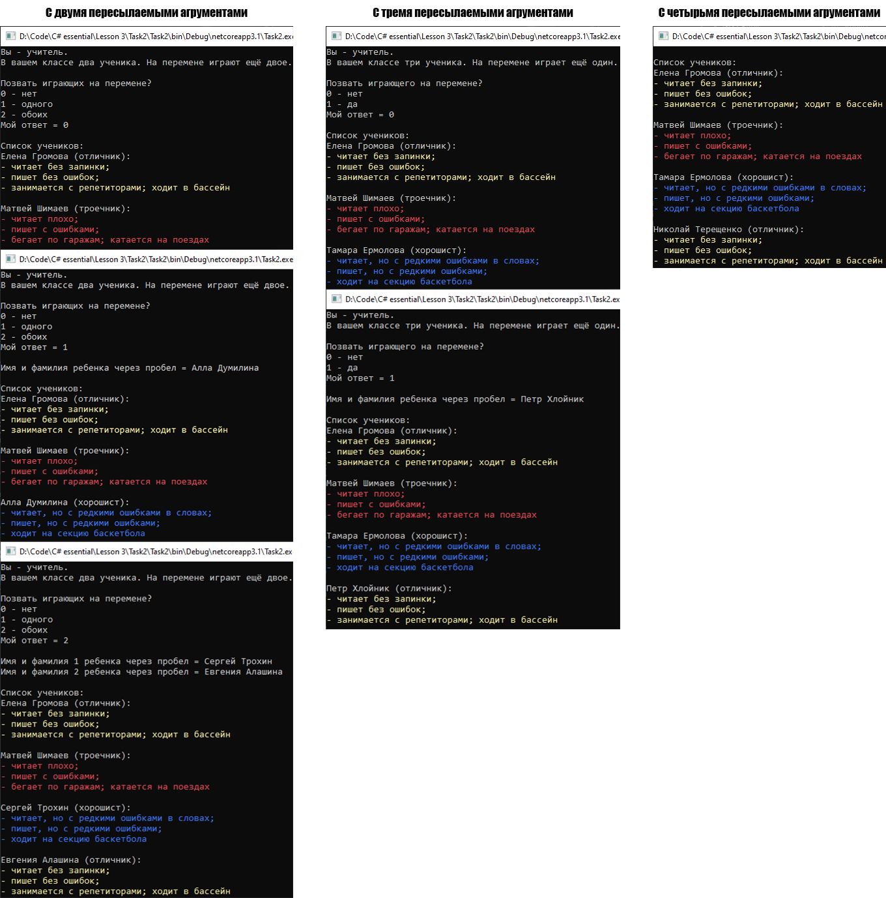

# Lesson3_task2
Условия задачки:
>Используя Visual Studio, создайте проект по шаблону Console Application.  
Требуется:  
Создать класс, представляющий учебный класс ClassRoom.  
Создайте класс ученик Pupil.  В теле класса создайте методы void Study(), void Read(), void Write(), void Relax().  
Создайте 3 производных класса ExcelentPupil, GoodPupil, BadPupil  от класса базового класса Pupil и переопределите каждый из методов, в зависимости от успеваемости ученика.   
Конструктор класса ClassRoom принимает аргументы типа Pupil, класс должен состоять из 4 учеников. 
Предусмотрите возможность того, что пользователь может передать 2 или 3 аргумента.  
Выведите информацию о том, как все ученики экземпляра класса ClassRoom умеют учиться, читать, писать, отдыхать.

От себя:
>В файле Program.cs на 25 строке можно передать пользовательскому конструктору экзмепляра classRoom от 2 до 4 аргументов (максимум 4 входящий аргумента). Аргументы задаются руками, в стиле: pupil[1], pupil[2], pupil[3], pupil[4]. 

Подытог: вот такенный майндфак на выходе
>
